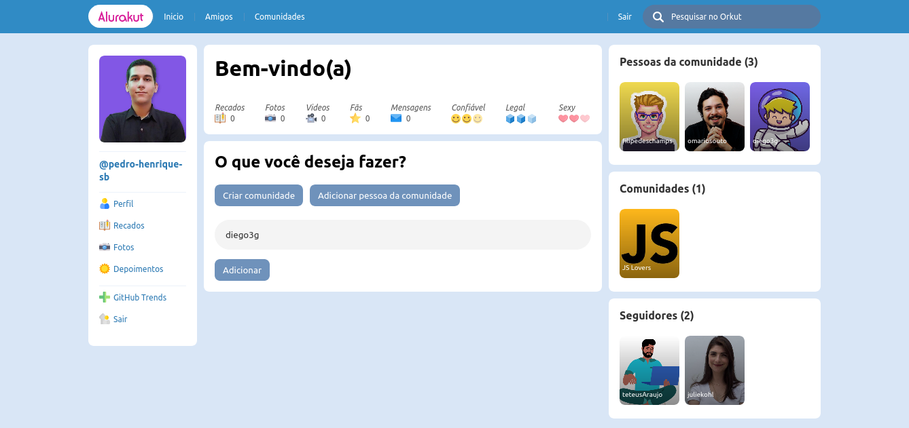

  

  
  

<h1></h1>

## 📑 Description

The rebirth of Orkut with the most modern Front-end technologies.

## 🧰 Technologies

This project was developed with the following technologies:

- [React](https://reactjs.org/)
- [NextJS](https://www.nextjs.org/)
- [DatoCMS](https://datocms.com/)
- [Nookies](https://www.npmjs.com/package/nookies)
- [Styled-components](https://styled-components.com/)

## 🧪 How to run

Access the version currently on air on [`https://alurakut-bay.vercel.app/`](https://alurakut-bay.vercel.app/) or...

- Clone the repository
- Install dependencies with `yarn`
- Start the server with `yarn dev`

Access from [`localhost:3000`](http://localhost:3000) your browser

---

Criado com orgulho durante a Imersão React da Alura 🤿
